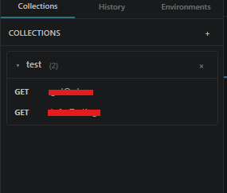
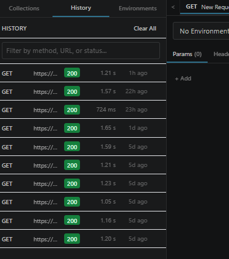

# User Guide — GI-SP API Client

> A complete how-to for using the extension. If you only want a quick overview, see the [README](../README.md).

---

## Table of contents

1. [First-time activation](#first-time-activation)
2. [License Status — knowing where you stand](#license-status--knowing-where-you-stand)
3. [Sending a request](#sending-a-request)
4. [Working with SOAP](#working-with-soap)
5. [Authentication](#authentication)
6. [Environment-level authentication](#environment-level-authentication)
7. [Collections](#collections)
8. [Environments and variables](#environments-and-variables)
9. [Request history](#request-history)
10. [Generating cURL and AL code](#generating-curl-and-al-code)
11. [Settings](#settings)
12. [Commands](#commands)
13. [Troubleshooting](#troubleshooting)

---

## First-time activation

After install, the panel auto-opens with an **Activation** screen. You have **two ways** to unlock:


### Option A — Activate Trial Version (recommended for first-time evaluation)

1. Click **Activate Trial Version (1 Month)** — the prominent button at the top of the activation screen.
2. You're activated instantly with the `User` role for **30 days**. No email exchange, no code to type.
3. The extension records your machine ID, hostname, OS username, and approximate `country` / `city` (via `ipapi.co`) to the publisher's central sheet.

**Limits:**
- One trial per machine — once your machine has a row in the activation sheet, the trial button disappears and you'll need a real code on next activation.
- Trial is always `User` role (Collections-only sidebar). For full admin access, use Option B.

### Option B — Request an activation code

1. Click **Request Activation Code**. The publisher receives an email with **two** 6-digit codes (Admin and User).
2. Contact the publisher at **`spdynamics365@gmail.com`** and receive one of the codes:
   - **Admin code** → full sidebar (Collections + History + Environments) + environment selector on the request page
   - **User code** → Collections-only sidebar, no environment selector
3. Enter the code and click **Activate**.
4. Your activation is valid for **30 days**. The publisher can extend it.

Activation is **per-machine** — a fresh install on a new computer needs a new code (or a new trial, if you've never trialled on that machine).

If you ever need to start over: `Ctrl+Shift+P` → **GI-SP API Client: Reset Activation** → click **Reset** → reload window. Note: this clears the local cache but does not delete your row in the central sheet, so the trial button will not reappear.

---

## License Status — knowing where you stand

Three surfaces tell you, at all times, what your license looks like:

### 1. Status bar widget (always visible)

Bottom-right of VS Code:

```
🔑 GI-SP: Admin · 28d
```

Format: `🔑 GI-SP: <role> · <days remaining>d`. Click it to open the License Status panel.

Background color tiers:
| Days remaining | Color |
|---|---|
| `> 7` | Default (theme) |
| `≤ 7` | Orange |
| `≤ 3` | Red |

The widget refreshes hourly so the day counter ticks down automatically.

### 2. Expiry warning banner

When ≤7 days remain, a banner appears at the top of the main panel:

> ⚠️ **Your license expires in 6 days.** Contact the publisher to extend before access stops. — [View license]

Click **View license** to open the License Status modal.

### 3. License Status modal

Open from the status bar widget, the expiry banner, or via Command Palette → **GI-SP API Client: View License**.

Shows:
- **Plan badge** — `Trial` (orange) or `Activated` (green)
- **Role** — `Admin` / `User`
- **Activated on** — date the row was created in the sheet
- **Expires on** — exact timestamp; days-remaining indicator
- **Country / City** — geo recorded at activation time (trial only)
- **Code used** — `TRIAL`, or the 6-digit code from Option B
- **Machine ID / Hostname** — what's identifying you to the backend

---

## Sending a request

1. The panel opens with a default `GET` request.
2. Type a URL in the address bar (e.g. `https://api.github.com/users/octocat`).
3. Pick a method from the dropdown (`GET`, `POST`, `PUT`, etc.).
4. Click **Send**.


The response shows in the bottom pane:
- Status code, response time, body size, content type
- Tabs for **Body**, **Headers**, **cURL**, **AL Code**

### Tabs in the request editor

| Tab | What it does |
|---|---|
| **Params** | Query string parameters (`?key=value`). Per-row enable/disable. |
| **Headers** | Request headers. Per-row enable/disable. |
| **Body** | Pick a body type (JSON, Raw / XML / SOAP / Text, Form URL Encoded, Form Data, Binary). |
| **Auth** | Pick an auth method (see [Authentication](#authentication) below). |

### Multiple requests at once

The tab bar at the top of the request panel lets you keep multiple requests open simultaneously. Click `+` to add a tab, click the `×` on a tab to close it.

---

## Working with SOAP

SOAP is HTTP `POST` with an XML body. The extension supports SOAP first-class:

1. Set method to **POST**.
2. **Body** tab → pick **Raw / XML / SOAP / Text**.
3. Click **Insert SOAP envelope** — a clean SOAP 1.1 envelope appears, ready for you to fill in.
4. Add the `SOAPAction` header in the **Headers** tab:
   - Key: `SOAPAction`
   - Value: `"http://example.com/MyOperation"` (with quotes — most SOAP servers expect them)
5. Set the `Content-Type` header to `text/xml; charset=utf-8` (or `application/soap+xml` for SOAP 1.2).
6. Send.

The response viewer pretty-prints XML automatically.

---

## Authentication

Click the **Auth** tab and pick from the dropdown:

| Method | Use it when |
|---|---|
| **No Auth** | Public endpoints |
| **Basic Auth** | Legacy systems, internal tools |
| **Bearer Token** | You already have a token (JWT, etc.) |
| **API Key** | The API uses a simple key in a header or query parameter |
| **OAuth2 — Client Credentials** | Server-to-server with no user; e.g. Azure AD app-only |
| **OAuth2 — Authorization Code** | Interactive sign-in; browser opens and captures the redirect |
| **OAuth2 — Password** | Legacy or private IdPs that still allow ROPC grant |

### OAuth2 — Client Credentials

Fill in: `Client ID`, `Client Secret`, `Token URL`, `Scope`, optional `Resource`. The first request fetches a token automatically. Microsoft endpoints (`login.microsoftonline.com`) use MSAL under the hood.

### OAuth2 — Authorization Code

Fill in: `Client ID`, `Client Secret` (optional for public clients), `Authorization URL`, `Token URL`, `Redirect URI`, `Scope`. Click **Get Token** — a browser opens. After you sign in, you'll be redirected back and the token is captured. Uses PKCE (S256) + a random `state` for CSRF protection. Redirect URI must be `localhost` / `127.0.0.1`.

### OAuth2 — Password

Fill in: `Token URL`, `Client ID`, `Client Secret` (optional), `Username`, `Password`, `Scope`, optional `Resource`. The extension POSTs `grant_type=password` and caches the resulting token.

### Token expiry

The Auth tab shows live status:
- **Active — expires in 45m**
- **Expiring soon — 3m left** (warning)
- **Expired** (red)
- **Token acquired** (no expiry returned)

Click **Get New Token** to refresh, or **Clear Token** to discard.

---

## Environment-level authentication

> Admin role only (the feature lives inside Environment editing, which is admin-gated).

You can attach an auth configuration to an environment itself, so every request that runs against that environment inherits the credentials automatically. Great for "Dev uses one set of OAuth2 creds, Prod uses another" workflows.


### Configure environment auth

1. Open the **Environments** sidebar tab.
2. Click an environment to edit it.
3. Scroll to the **Authentication** section.
4. Pick a type: **None, Basic, Bearer, API Key, OAuth2 Client Credentials, OAuth2 Password**.
   *(Interactive flows like OAuth2 Authorization Code are not available at the environment level — those need to live on a request.)*
5. Fill in the fields and **Save** the environment.

### How it applies at send-time

The rule is simple and predictable:

| Request's own `Auth` tab | Active environment has auth? | What's actually sent |
|---|---|---|
| Set to anything except **No Auth** | — | **Request auth** (env is ignored) |
| **No Auth** | Yes | **Environment auth** (auto-applied) |
| **No Auth** | No / no active env | No auth header sent |

**Visual indicator:** when environment auth is being applied to a request, an **Env** badge appears next to the auth type in the Auth tab — so you always know where the credentials came from.

### Why this matters

- Switch environments and your auth switches too — no copy-pasting tokens.
- Share collections without leaking secrets — the auth lives in your local environment, not in the collection JSON.
- Service-to-service OAuth2 just works: set Client Credentials on Dev/Staging/Prod once, then every saved request inherits.

### Environment selector on the URL bar

For admin users, an environment dropdown appears in the request URL bar (next to the **Send** button) — switch environments without opening the sidebar. Hidden for `user` role for consistency with the role-gated sidebar.

---

## Collections

Open the **Collections** sidebar tab (left side, both Admin and User roles).



### Create a collection
- Click the **+** in the Collections panel, OR
- Run `Ctrl+Shift+P` → **GI-SP API Client: New Collection**.

### Save a request to a collection
- With a request open, click the **Save** icon next to the URL bar.
- Pick the destination collection.

### Import / export
- Import Postman v2 collections or our native JSON format: `Ctrl+Shift+P` → **GI-SP API Client: Import Collection**.
- Export any collection: `Ctrl+Shift+P` → **GI-SP API Client: Export Collection**.

**Note:** Postman import currently covers raw JSON bodies only — form data, auth, and folder hierarchy from Postman are not fully imported.

### Click any saved request
Loads it into a new request tab.

---

## Environments and variables

> Admin role only.

Define different sets of variables for **Dev**, **Staging**, **Production**, etc. Reference them anywhere in URL, headers, query params, or body with `{{variableName}}`.

### Create an environment
- Open the **Environments** sidebar tab.
- Click **+** to create a new environment.
- Add variables (e.g. `baseUrl` = `https://api-dev.example.com`).
- Click the radio button next to a name to make it active.

### Use a variable
Anywhere you'd type a value, type `{{baseUrl}}` instead. At send-time, the active environment's value is substituted.

### Authentication on environments
Environments can also carry an **Authentication** config — see [Environment-level authentication](#environment-level-authentication) above. The short version: set Bearer / API Key / OAuth2 once per environment, and any request with "No Auth" on it will inherit those credentials automatically.

### Built-in dynamic variables (no environment needed)

| Variable | Substituted with |
|---|---|
| `{{$timestamp}}` | Current Unix milliseconds |
| `{{$isoTimestamp}}` | Current ISO-8601 timestamp |
| `{{$randomInt}}` | A random integer 0–999999 |
| `{{$guid}}` / `{{$randomUUID}}` | A random UUID v4 |

### Known limitation
Variables are only interpolated inside `body.content` (the raw text body). They are **not** interpolated inside Form Data field values or GraphQL query/variables (Phase 2 feature). Workaround: use the raw body type if you need variable interpolation.

---

## Request history

> Admin role only.

Open the **History** sidebar tab. Every request you send appears (newest first), up to 500 entries (configurable). Click any entry to reload that request into a new tab.



History never stores authentication credentials — auth is automatically scrubbed before being persisted.

Clear history: `Ctrl+Shift+P` → **GI-SP API Client: Clear History**.

---

## Generating cURL and AL code

After sending a request, the response panel offers two code-generation tabs:

### cURL
Click **Generate cURL** — copy the equivalent shell command. Includes all headers, query params, body, and auth.

### AL Code (Business Central)
Click **Generate AL Code** — get a ready-to-paste AL procedure with:
- `HttpClient` / `HttpRequestMessage` / `HttpResponseMessage` setup
- All headers, auth, and body pre-filled
- A companion `AcquireAccessToken` procedure for OAuth2 flows (Client Credentials, Authorization Code, or Password — picks the right shape based on your auth config)
- Proper `SecretText` usage for sensitive values


This is the unique feature for Business Central / Microsoft Dynamics 365 developers.

---

## Settings

Open VS Code Settings (`Ctrl+,`) → search "GI-SP API Client".

| Setting | Default | Description |
|---|---|---|
| `giSpApi.requestTimeout` | `30000` | Request timeout in milliseconds |
| `giSpApi.maxHistoryEntries` | `500` | Maximum history entries kept |
| `giSpApi.followRedirects` | `true` | Follow HTTP 3xx redirects |
| `giSpApi.sslVerification` | `true` | Verify SSL certificates |
| `giSpApi.maxResponseSize` | `10485760` | Max response body size (bytes; default 10 MB) |

VS Code's built-in `http.proxy` setting is also honored.

---

## Commands

All commands are accessible via `Ctrl+Shift+P` → type "GI-SP API Client".

| Command | What it does |
|---|---|
| `GI-SP API Client: Open` | Open the main panel |
| `GI-SP API Client: New Request` | Open a new request tab |
| `GI-SP API Client: Save Request` | Save current request to a collection |
| `GI-SP API Client: New Collection` | Create a new collection |
| `GI-SP API Client: New Environment` | Create a new environment |
| `GI-SP API Client: Import Collection` | Import JSON / Postman v2 |
| `GI-SP API Client: Export Collection` | Export a collection to JSON |
| `GI-SP API Client: Clear History` | Delete all history entries |
| `GI-SP API Client: View License` | Open the License Status panel |
| `GI-SP API Client: Reset Activation` | Clear cached license; useful when switching machines |

---

## Troubleshooting

| Symptom | Likely cause | Fix |
|---|---|---|
| **Activate Trial** button missing on activation screen | Your machine already has a row in the activation sheet | Trial is one-time per machine; request a real activation code instead |
| Trial activated but country / city shows blank in License Status | `ipapi.co` was unreachable when you activated, or the Apps Script hasn't been redeployed with v2 columns | Ask the publisher to redeploy the Apps Script; geo capture is best-effort and doesn't block activation |
| Status bar widget shows wrong day count | Widget refreshes hourly; you may have just crossed a day boundary | Reload the VS Code window — counter will update immediately |
| Expiry banner won't go away after extension | Cached license is stale | Run **Reset Activation** then re-enter your code — backend will return the new expiry |
| Activation gate keeps showing | Cached license expired or backend unreachable | Run **Reset Activation**, reload, request fresh code |
| Environment auth isn't being applied to my request | Your request's Auth tab is set to something other than **No Auth** | Set request Auth to **No Auth** — env auth only fills the gap when the request itself has none |
| **Env** badge appears unexpectedly in Auth tab | Your active environment has auth configured and your request is on **No Auth** | This is correct behavior; pick a different environment or set request-level auth to override |
| Environment dropdown missing on URL bar | You're on `User` role | Re-activate with an Admin code |
| "Could not reach the mail server" on activation request | Your network blocks SMTP (port 465) | Try a different network (mobile hotspot) or contact your IT team |
| OAuth2 Authorization Code: "Port already in use" | Another app is using the redirect URI's port | Change the Redirect URI port (e.g. `http://localhost:8401/callback`) |
| OAuth2 token expired but auto-refresh fails | Cached refresh token is invalid | Click **Get New Token** to re-authenticate |
| Variables aren't being substituted | Variable is inside Form Data or GraphQL (Phase 2) | Switch to raw body type, or wait for Phase 2 |
| Postman collection imported but body looks wrong | Postman's complex bodies aren't fully mapped | Edit the body manually after import |
| Sidebar tabs missing | You activated with the User code or a trial | Re-activate with the Admin code |
| Response too large | Response exceeds `maxResponseSize` | Increase the setting, or ask the API for pagination |
